# Lab Report: UX/UI
___
**Course:** CIS 411, Spring 2024  
**Instructor(s):** [Devi Bhakta Suberi](https://github.com/dsuberi)  
**Name:** Noah Barrall 
**GitHub Handle:** @NoahBarrall  
**Repository:** https://github.com/NoahBarrall/cis411_lab3_uiux?tab=readme-ov-file 
**Collaborators:**   
___

# Step 1: Confirm Lab Setup
- [ Y ] I have forked the repository and created my lab report
- [ Y ] If I'm collaborating on this project, I have included their handles on the report and confirm that my report is informed, but not copied from my collaborators.

# Step 2: Evaluate Online Job Search Sites

## 2.1 Summary
| Site | Score | Summary |
|---|---|---|
| Indeed | 9.5/10 | Overall, I like Indeed. It is super easy to find everything that you need. The job title and location is always at the top so you can always refine your search, which I really like. The only thing that I don't exactly like is that people can get easily confused as to what is in profile and what is in settings. The site is laid out just about as best as it can be. |
| USAJOBS | 9/10 | This site isn't bad at all. I think it is laid out really well, I had no issues finding anything on the site. The one thing that I didn't like was the searching component, where you have to click on one of the keywords that lists sections and if you don't click on one of them you get a super general search with like 100,000 results. Overall I like the site a lot for a government website  |

## 2.2 Site 1

## Create account on Indeed
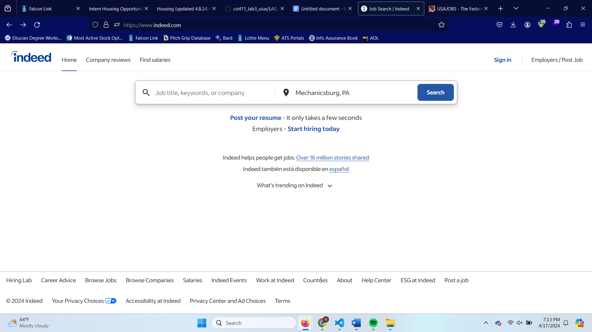
This is the starting page that you first open when the site opens. I like how it is laid out, it is simple and easy to find what you need to get started and sign up.

Here is the sign in page. It gives 3 options, either to give your email address, continue with google or apple. 

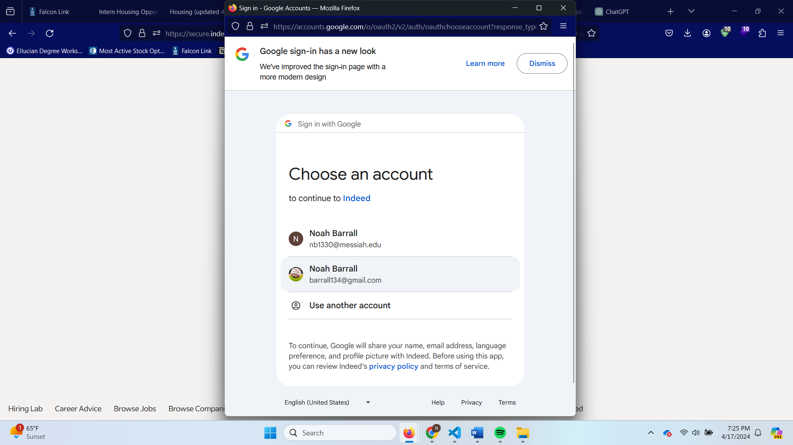
You then choose your email address that you want to use, which is just the typical google sign in that I chose.

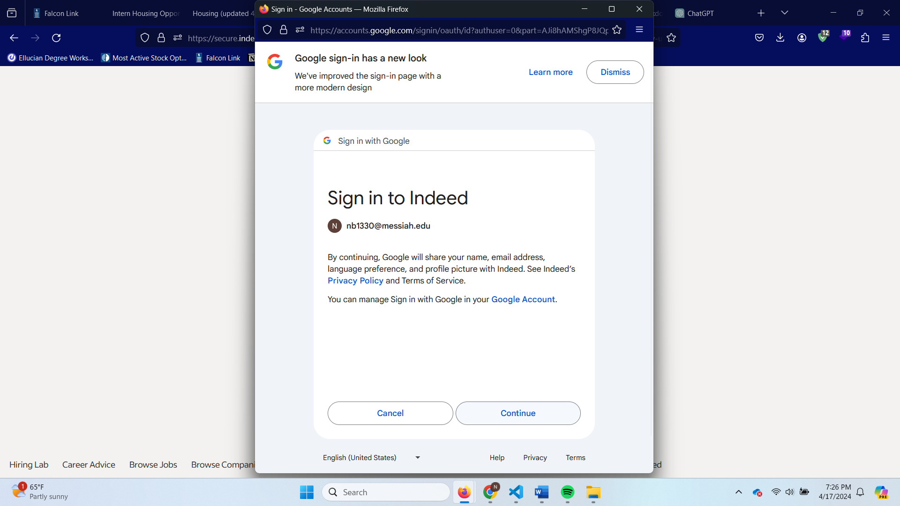
It then prompts you to share your information when you sign in with Google to indeed. 

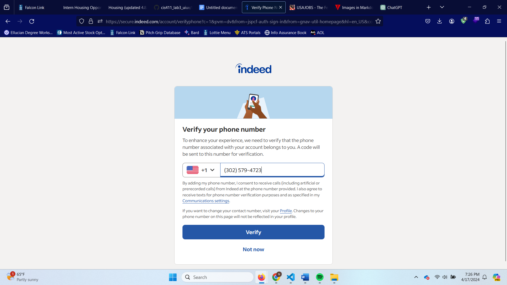
Indeed then asks you to verify your phone number to confirm your identity. I like this page because its super simple and is easy to find things.

Once you verify your phone number, it then prompts you for your location. I like the simplicity, and the idea of the button for interested in remote work.

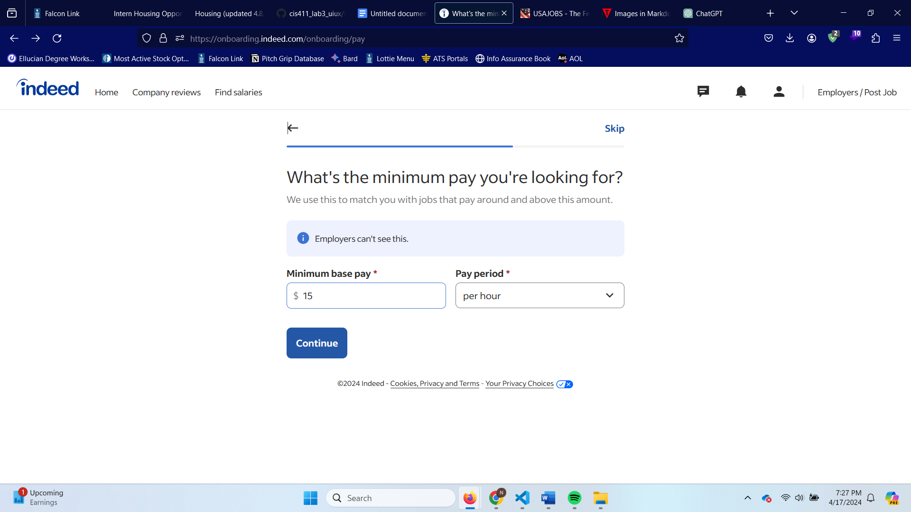
After entering your your location, it asks you for what you want your base pay to be and how your pay period should work. I don't really like the idea of them asking you how much you want to get paid, it could limit the options if the listing is not correct.

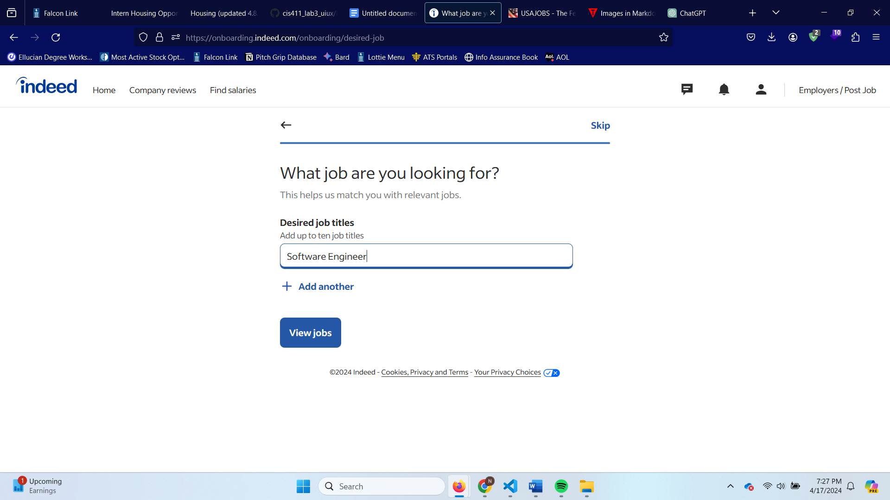
After asking for the pay information, it asks what job titles you are looking for, and you can enter that. I do like this idea though, it adds a good way to get started on your job search.

## Indeed Skills Update
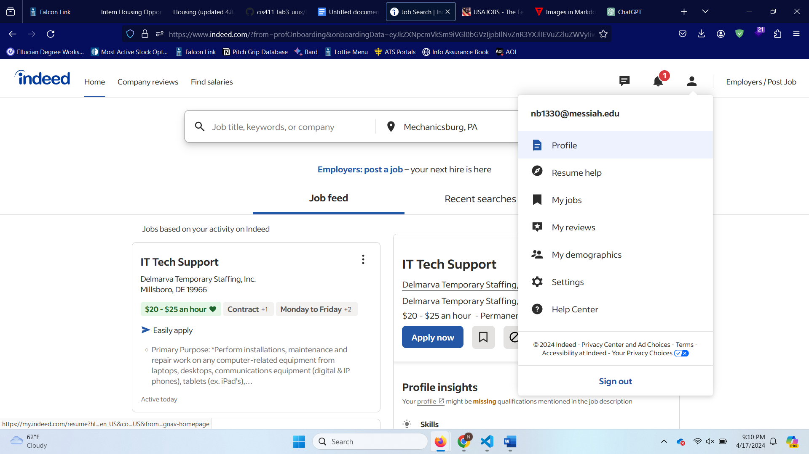
On the home page, you can click on the profile button and hit profile to get to the skills/qualifications. It is easy to find if you look for it, but I can't say this is my favorite section. It is hard to find if you don't go to the profile section first. I think it would benefit off having their own qualifications/skills section.
https://www.indeed.com/?from=gnav-jobseeker-profile--profile-one-frontend

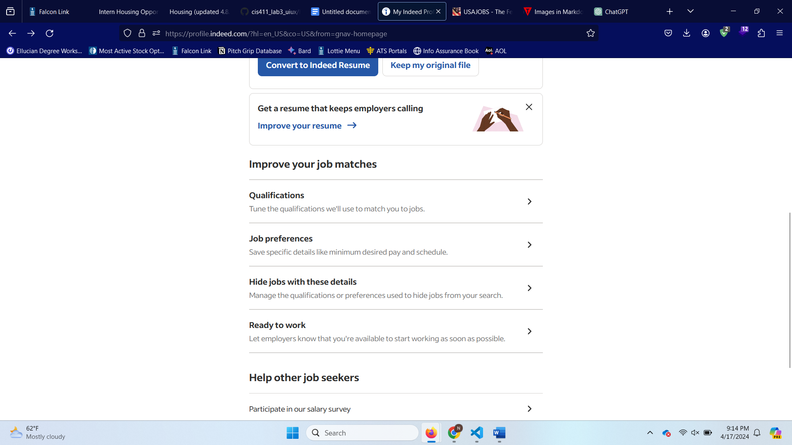
After clicking on the profile section, you can scroll down and navigate to the qualifications section. Once you find which section it is in, it is right there. 
https://profile.indeed.com/?hl=en_US&co=US&from=gnav-homepage

You can then enter your skills. This section is super easy and I think this has been an easy one to do.
https://profile.indeed.com/qualifications

## Indeed Applying for Job

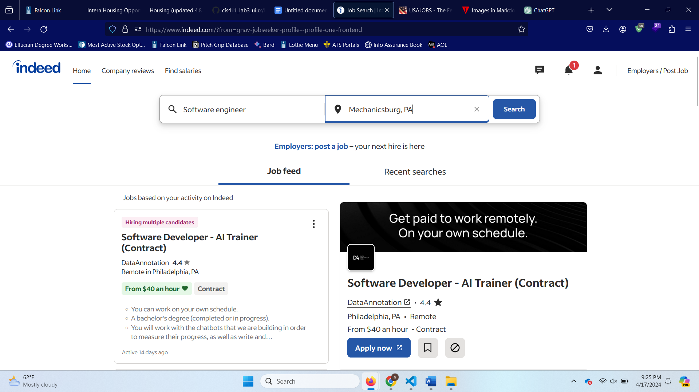
Once you navigate back to the home screen, to apply for a job, you can search for a job title and a location. This part is super easy to find. It is on the top of the screen no matter what
https://www.indeed.com/jobs?q=software%20engineer&l=Mechanicsburg%2C%20PA&from=searchOnHP

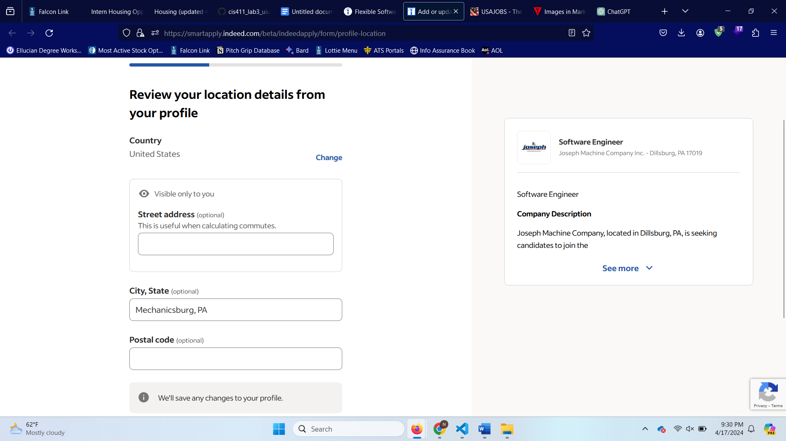
Once you find a job that you want to apply for, it takes you to a page that you have to enter your location if you want. I like this page because it allows the employer to know where you are located. 

It then prompts you to add your own resume or build a resume on their site. I like this because it gives you the option to create your own if you don't have one already, which could help beginners on their journey.

It then prompts you for a few more questions and you can submit your application! Easy as that.

| Category | Grade (0-3) | Comments / Justification |
|---|---|---|
| 1. **Don't make me think:** How intuitive was this site? |  3 | I didn't really have to think about anything on this site. Everything was easy to find.  |
| 2. **Users are busy:** Did this site value your time?  | 3  | It took me less than 10 minutes to set up an account, set my personal skills, and apply for my first job.  |
| 3. **Good billboard design:** Did this site make the important steps and information clear? How or how not? | 1  | The site didn't really direct you on anything after you signed in, I think once you sign in, there should be a few steps helping you set up your profile.  |
| 4. **Tell me what to do:** Did this site lead you towards a specific, opinionated path? | 1  | As mentioned in the last step, it only helped with setting up and account, not anything else after, which would be nice.  |
| 5. **Omit Words:** How careful was this site with its use of copy? | 3  | The site has no unnecessary use of words, and it is super effecient with its use of white space.  |
| 6. **Navigation:** How effective was the workflow / navigation of the site? | 3  | I think this sites workflow is super simple. As mentioned before, everything took me less than 10 minutes and I didn't have to search up how to do anything. There was no slow pieces or things that were clunky.  |
| 7. **Accessibility:** How accessible is this site to a screen reader or a mouse-less interface? | 2  | The site is simple enough where if you wanted to tab over to things, it wouldn't take that long to navigate thru all the components.  |
| **TOTAL** | 16  | Great site, could use some small adjustments to make it even better.  |

## 2.3 Site 2

# USAJOBS Create Account
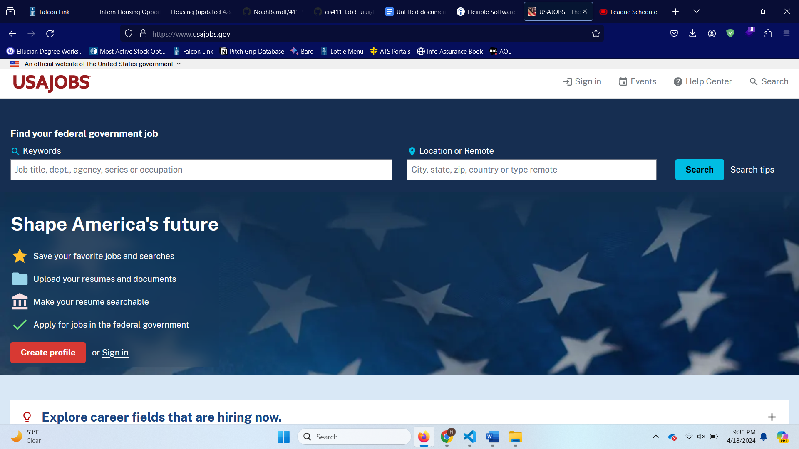
This is the USAJOBS website. Based on prior experiences, I already know that this site is not as user friendly as Indeed is. But if you are going on this site trying to find a good job in the government, chances are you are smart enough to navigate your way around the site. The layout looks sort of sloppy and basic, but overall when you actually look at it, things are laid out nice and fairly easy to find.
https://www.usajobs.gov/

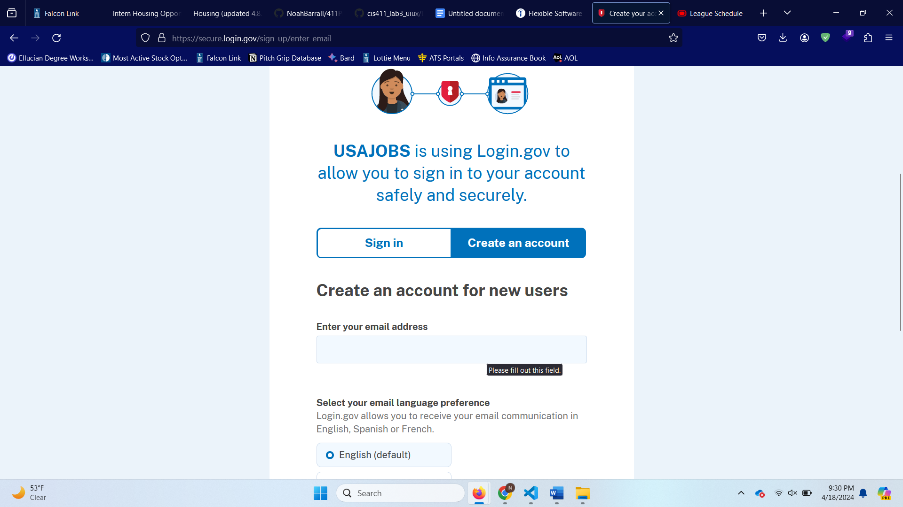
To create an account, there is a nice big button on the home screen that says sign in, and once you click that you can either sign in or create an account. For me, I chose to sign in. Once I scrolled down, since I already had an account, my information was already there and all I had to do was hit sign in. I liked this section, it was super easy to find all that I needed, and the components were very well laid out.

Once signed in, it prompts you to verify yourself and I entered my the code that the system sent to my phone number. I really liked the idea of the remember this browser button. A lot of sites don't do this, but some browsers do it by default and save your information that way.

## Updating Profile USAJOBS

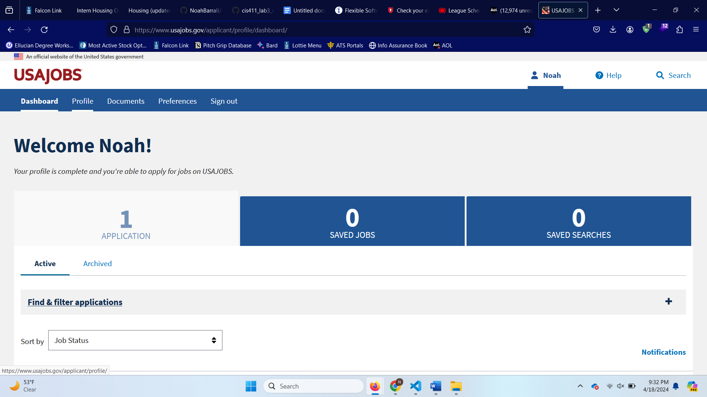
It then brings you to this home page, where you can click on profile to go and update your preferences. As I mentioned earlier, the site is super basic, but everything is laid out right in front of you and easy to find.
https://www.usajobs.gov/applicant/profile/dashboard/

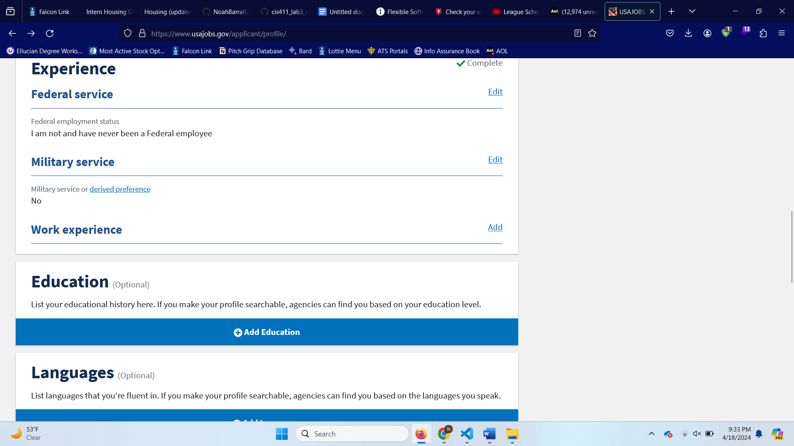
Once you click on profile, it then brings you to this page, where there is no section for qualifications or skills, but there are sections like education, experience, languages, organizations, and references. So the idea of adding skills is not there. I personally like that, while on other job sites they rely on some you reaching out and some recruiters viewing your profile, on here you only reach out and apply so there is no need to fill in an unncessary section.
https://www.usajobs.gov/applicant/profile/

## Applying for job USAJOBS

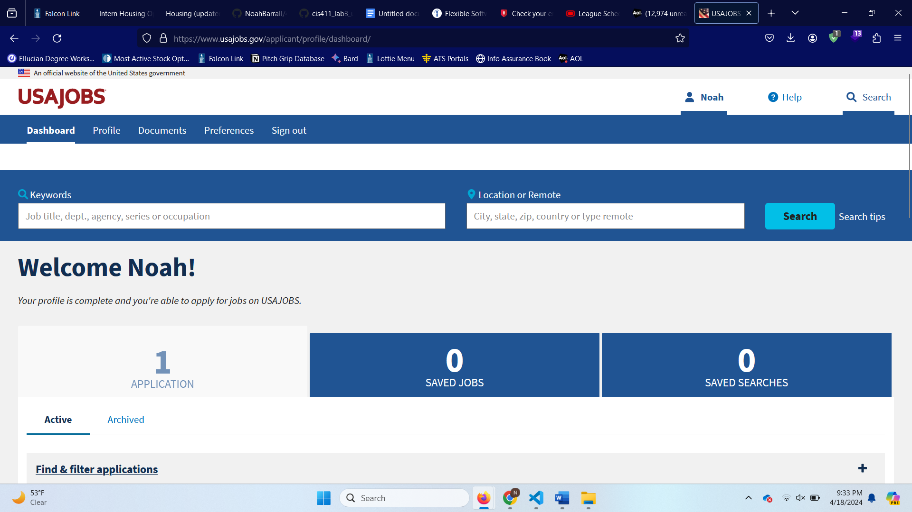
In this area, to apply for a job you first look at the top and its super easy to find, which I really like. You enter keywords and a location. The one thing I don't like about the keywords is you can't enter your own thing, you have to click on one of the presets when typing a word in. Overall, not bad on the design of the job search tho, I know they have specific standards when dealing with the government.
https://www.usajobs.gov/Search/Results?j=2200

Finally, once you search the job and click on one that you want, there is a section on all of them that say "How to Apply." I really like this, it makes it super simple and easy to figure out how to apply as long as you read the instructions. So for here all I would need to do is email my resume to that email address and I am done! This has probably been the easiest section so far.
https://www.usajobs.gov/job/725409700

| Category | Grade (0-3) | Comments / Justification |
|---|---|---|
| 1. **Don't make me think:** How intuitive was this site? | 3  | I didn't have to think to find anything here, super simple layout and I really liked it.  |
| 2. **Users are busy:** Did this site value your time?  | 3  | Yes, as Indeed also did, it took less than 10 minutes to sign up and apply for a job.  |
| 3. **Good billboard design:** Did this site make the important steps and information clear? How or how not? | 2  | It was decent, the account setup was good, the site showed you and walked through all of it with you, but after that it was up to you to figure it out. |
| 4. **Tell me what to do:** Did this site lead you towards a specific, opinionated path? | 1  | Not really, just help set up an account and after that you are on your own. Which I think is fair considering it is a government site.  |
| 5. **Omit Words:** How careful was this site with its use of copy? |  1 | There are some excess things on the site that make things look a little sloppy.  |
| 6. **Navigation:** How effective was the workflow / navigation of the site? | 3  | Workflow was great, super easy to work through and navigation was about as easy as it gets.  |
| 7. **Accessibility:** How accessible is this site to a screen reader or a mouse-less interface? | 2  | I think it would be fairly easy. There is some junk on the screen that is not needed, but can be easy to tab through the page.  |
| **TOTAL** | 15  | Overall fairly good site, just not as good as Indeed.  |

# Step 3 Competitive Usability Test

## Step 3.1 Product Use Case

| Use Case #1 | |
|---|---|
| Title: View 8 Semester Plan | |
| Description: Registered Computer Science student views the assigned 8 semester plan based on their major/concentration/minor | |
| Actor: Student | |
| Preconditions: Student registered in Computer Science, Classes checked for approval on plan| |
| Postconditions: Student saves edited plan to database, Student emails new plan to advisor | |

## Step 3.2 Identifier a competitive product

List of Competitors
1. Competitor 1 [Degreeworks]([www.awesomesauce.com](https://degreeworks-c.messiah.edu:8441/worksheets/WEB31))
2. Competitor 2 [The View](https://ssb8c.messiah.edu/ssb8/mc_schdlist.P_Schedule_List_Init?TERM_IN=200810)
3. Competitor 3 [Ellucian](https://ssb-regc.messiah.edu/StudentRegistrationSsb/ssb/registration)
4. Comptitor 4 [8 Sem Plan Messiah](https://www.messiah.edu/download/downloads/id/6041/2018_Advising_handbook_III_CIS.pdf)

## Step 3.3 Write a Useability Test

| Step | Tasks | Notes |
|---|---|---|
| 1 | Log on to system with Messiah Credentials  | Will be prompted when first opening the page  |
| 2 | Navigate to 8 Semester Planner Tab | Button on top of page  |
| 3 | Hit Edit Button on 8 Semester Planner  |   |
| 4 | Edit planner to desired Major/Concentration/Minor  |   |
| 5 | Save New Plan  | Button in bottom right  |
| 6 | Student emails new plan to advisor from site  | Will be a button that says share  |

## Step 3.4 Observe User Interactions

| Step | Tasks | Observations |
|---|---|---|
| 1 | Log on to system with Messiah Credentials  | Participant opens site and immediately has to log with Messiah credentials. They said it was exactly as they expected it to be. The user was successful with this, as it is as simple as opening the site and that is the first thing you are prompted for.  |
| 2 | Navigate to 8 Semester Planner Tab  | Participant naviagtes to 8 Sem Planner tab on the top of the screen. They said it was exactly as they expected, as it is simple on the page. Yes, they were successful in finding this tab. The participant was suprised that it was that easy to find.   |
| 3 | Hit Edit Button on 8 Semester Planner  | Participant navigates to button on top left that says "Edit". They said the button it was super easy to find and navigate to. They said that they were suprised how easy it was to find the button. The basic steps they took were just clicking on the button and then it brings up the editing interface. Yes they were successful in finding the button.   |
| 4 | Edit planner to desired Major/Concentration/Minor  | The participant then is brought to the editing interface after clicking the edit button. They can then edit the plan to their preference. They were successful after a little bit of explaining on how the interface works. The participant was a little frustrated on not being able to completely understand the interface but after a few minutes they were able to figure it out and was just fine.   |
| 5 | Save New Plan  | The participant then will click the save button. They said they expected it to be much harder to save the plan but it was just one click of a button. They were successful in finding the save button, and they were not frustrated at all.   |
| 6 | Student emails new plan to advisor from site  | The final step is that the participant clicked the share button and entered their advisors email to share to them. The user was a little frustrated because they had to search for their advisors email. But overall they liked that there was a share button that you could send right to your advisor with the updated plan.  |

## Step 3.5 Findings
I think 3 improvements for my workflow could be:
- Making the editing interface easier to use
- Providing suggested advisors emails
- Providing suggested classes to take during certain semesters

2 improvements that were beneficial to the user:
- Easy to find tab at the top of the page
- Automatically logs you in with Messiah credentials before the page even opens

What do you believe your team did well in conducting the usability test?
- Making the whole thing easy for the user to navigate
- Super easy for the user to save and send to advisor

What could your team improve for next time?
- Making the interface for the editing be either more user friendly or have a built in walk-through
- Explaining what is going on to the user a little more and maybe a small walk-through

Offer a brief statement about your experience conducting a usability test.
- I thought this experience was definitely challenging. Explaining to the user the actions they should be taking without actually telling them what to do was a difficult task. I think next time we should maybe make the usability test a little bit more in depth.